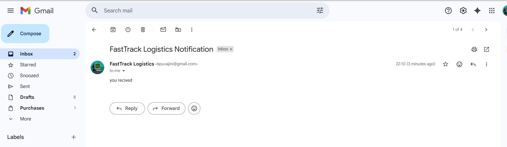

# 📦 Parcel Delivery Email Notification System


---

## 🚀 Project Overview

The **Parcel Delivery Email Notification System** is a Java-based application developed using Maven and run on IntelliJ IDEA.

This system automatically sends an email notification to the company when a delivery driver confirms a parcel delivery.

It improves delivery tracking, communication, and management efficiency.

---

## 🛠️ Technologies Used

- ☕ Java  
- 📦 Maven (pom.xml)  
- 🌐 HTML / CSS / JavaScript (Frontend)  
- 📧 Java Mail API  
- 💻 IntelliJ IDEA  

---

## ⚙️ How It Works

1️⃣ Driver enters parcel details  
2️⃣ Clicks **Confirm Delivery**  
3️⃣ System processes the request  
4️⃣ Email is generated automatically  
5️⃣ Company receives delivery confirmation  

---

## 📂 Project Structure

```
Parcel-Delivery-System/
│
├── src/
│   ├── main/
│   │   ├── java/
│   │   └── resources/
│
├── screenshots/
│   └── email.png
│
├── demo/
│   └── sent_message_notify.mp4
│
├── pom.xml
└── README.md
```

---

## 📸 Screenshot

### 🔹 Email Received


---

## 🎥 Screen Recording

▶️ Watch the working demo:

[Click Here to Watch Demo](demo/sent_message_notify.mp4)

---

## ▶️ How to Run the Project

1. Clone the repository:
```
git clone https://github.com/your-username/your-repository-name.git
```

2. Open the project in **IntelliJ IDEA**
3. Ensure Maven dependencies are downloaded
4. Run the main Java file
5. Open the frontend in your browser
6. Confirm parcel delivery and check email notification

---

## 🎯 Key Features

✔ Automatic Email Notification  
✔ Real-Time Delivery Confirmation  
✔ Simple and Clean UI  
✔ Maven Dependency Management  
✔ Easy to Maintain  

---

## 👨‍💻 Developed By

**Tharansanjai**  
Java Developer | Backend Developer  

---

⭐ If you like this project, give it a star on GitHub!
